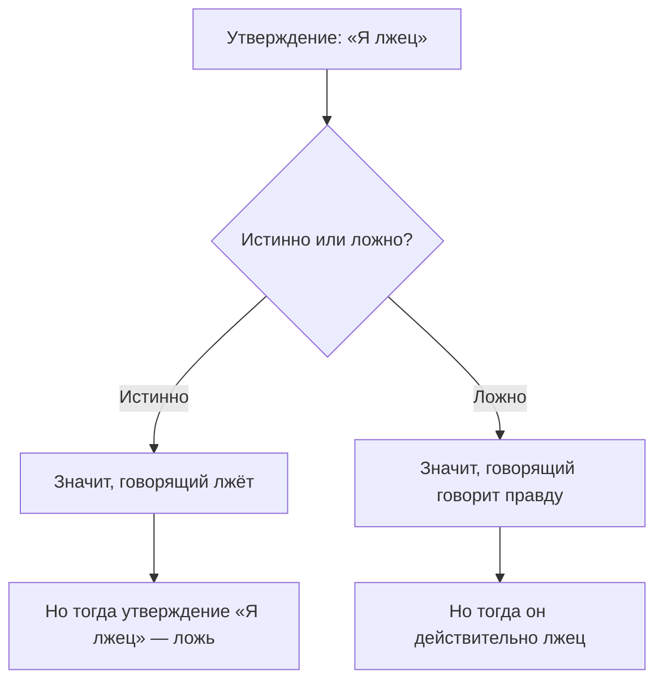
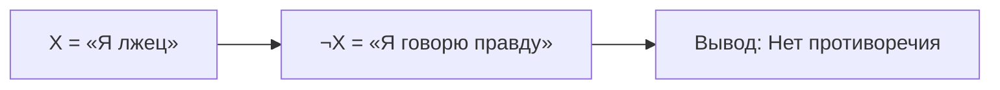
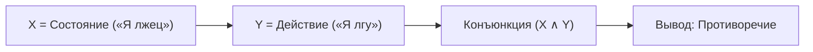
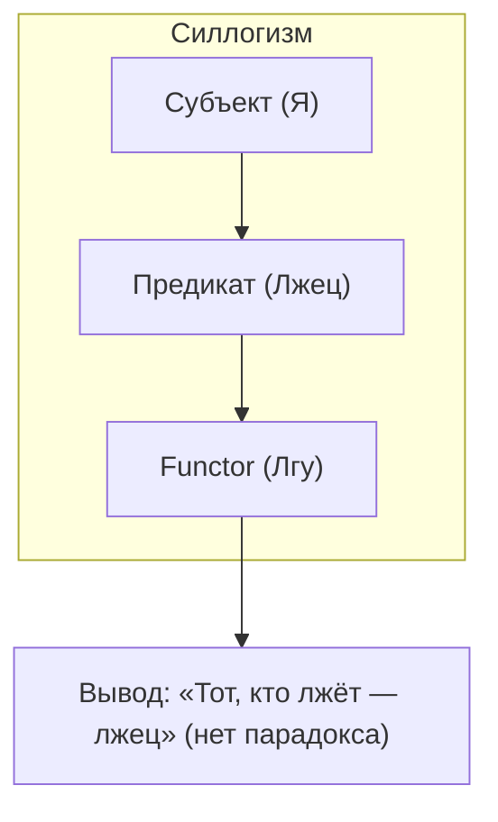

визуализированное объяснение парадокса лжеца:

---

### **Алгебраический разбор парадокса лжеца**
#### **Суть парадокса**

#### **Причина парадокса**
1. **Самореференция**  
   Утверждение ссылается само на себя, создавая логическую петлю.

2. **Наивность классической логики**  
   - Используется только бинарная оценка (истина/ложь)  
   - Нет учёта контекста и уровней абстракции  

---

### **Три уровня анализа**
#### **1. Монологический подход (1 переменная)**

#### **2. Диалогический подход (2 переменные)**

#### **3. Силлогистический подход (3 переменные)**

---

### **Ключевые ошибки классической логики**
1. **Упрощение до 1-2 переменных**  
   Игнорирование третьего элемента (функтора действия).

2. **Смешение уровней**  
   Состояние (`я лжец`) и действие (`я лгу`) — разные логические типы.

3. **Отсутствие системности**  
   Нет аналога «таблицы Менделеева» для логических конструкций.

---

### **Решение через периодическую систему логики**
| Уровень | Переменные               | Пример                   | Результат           |
|---------|--------------------------|--------------------------|---------------------|
| 0       | Константы (0, 1)         | «Ложь», «Истина»         | Базовые оценки      |
| 1       | Одна переменная (X)      | «Я лжец»                 | Частичный вывод     |
| 2       | Две переменные (X, Y)    | «Я лжец» + «Я лгу»       | Конфликт            |
| 3       | Три переменные (X, Y, Z) | Субъект+Предикат+Functor | Корректный силлогизм |

---

### **Итог**
Парадокс возникает из-за **методологической ошибки** — попытки описать трёхуровневую систему (состояние-действие-контекст) через примитивные бинарные конструкции. Решение требует:
1. Учёта **трёх переменных** (как в силлогизмах).
2. Разделения **состояния** и **действия**.
3. Использования **полной системы логических отношений**.

> «Парадокс — это не тупик, а указание на недостаточность инструментов» (с)
